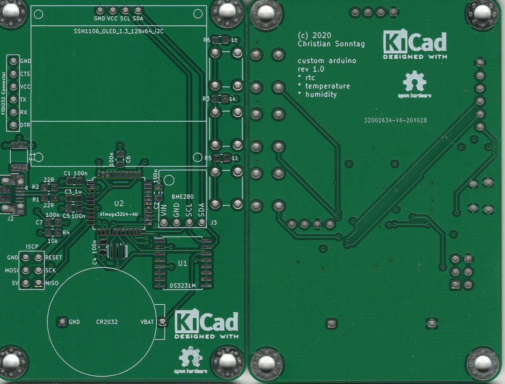
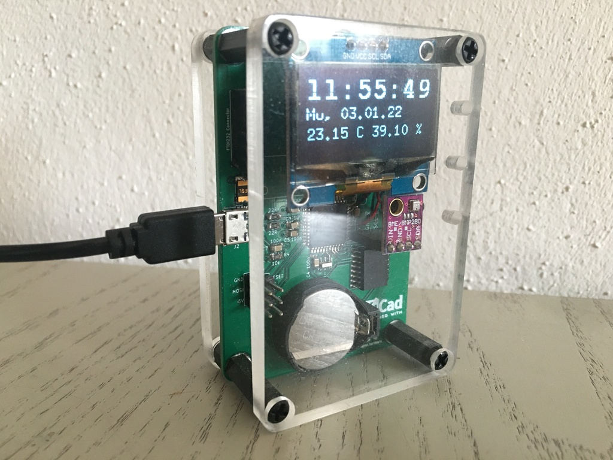
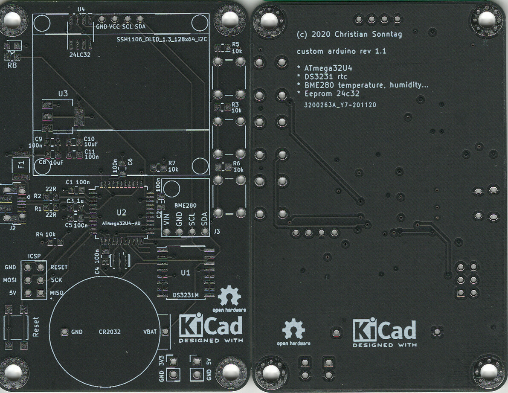

# Custom arduino pcb with ssh1106, rtc ds3231, bme280, battery and eeprom.

> **Preface:** Dont exspect too much this is a private learning hobbyist project 😜

This is just a learning project of how to build/design a custom arduino pcb (Pro Micro) using a Atmega32U4.
The aim was to learn something about electronics and how to design a custom arduino pcb with [KiCad](https://kicad-pcb.org/).
In this repo you can find miscellaneous datasheets and schematics of other resources and the [KiCad](https://kicad-pcb.org/) files of this project itself. Included are also files for a simple case for cnc machining.

Dont expect to much of the source code (```custom-arduino-rtc-bme280.ino```). It looks a little bit messy. Uses a lot of libs and lots of ram. Improvements could be: the use of interrupts instead of a delay routine, get rid of the libs and write own code that uses less ram. In fact that i have not mounted rev1.1 there is no code for the eeprom. The eeprom could be used to store temperature data for a graph like display.

But these are future issues if I get around to it 😜

## Revisions

Rev | PCB                                          | Build
--- |----------------------------------------------| ---
1.0 |  | 
1.1 |  | not build yet ;o)

## Changes

**rev1.0**
* first layout

**rev1.1**
* [BUGFIX] connection of buttons was wrong
* [REMOVE] FTDI connector
* [ADD] eeprom
* [ADD] power led
* [ADD] reset button
* [ADD] regulator for v3.3 and pinheaders for v3.3 and v5.

## Experiences

* quality of ssh1106 lcd can be messy. thats annoying! complete pixel rows can be faulty after some period of time. 
* pin assignment of ssh1104 lcd can vary (VCC and SCL are swapped?). keep an eye on it!

---

> **Following now are some random notes!**

## Bootloader

* Burned Bootloader with USBasp programmer.
* Using SparkFun Pro Micro bootloader.
* Programming with Arduino IDE works with (Port depending to operating system):
  * SparkFun Pro Micro -> Atmega32U4 (5v, 16 MHz) -> /dev/ttyACM0

## Pin Mapping Arduino and 32u4


## Arduino Pin Mapping

* https://www.arduino.cc/en/Hacking/PinMapping32u4
* https://www.arduino.cc/en/Hacking/PinMapping
* https://www.arduino.cc/en/Hacking/PinMapping168

## avrdude commands

```shell script
csg@csg-deskmini-300:~$ avrdude 
Usage: avrdude [options]
Options:
  -p <partno>                Required. Specify AVR device.
  -b <baudrate>              Override RS-232 baud rate.
  -B <bitclock>              Specify JTAG/STK500v2 bit clock period (us).
  -C <config-file>           Specify location of configuration file.
  -c <programmer>            Specify programmer type.
  -D                         Disable auto erase for flash memory
  -i <delay>                 ISP Clock Delay [in microseconds]
  -P <port>                  Specify connection port.
  -F                         Override invalid signature check.
  -e                         Perform a chip erase.
  -O                         Perform RC oscillator calibration (see AVR053). 
  -U <memtype>:r|w|v:<filename>[:format]
                             Memory operation specification.
                             Multiple -U options are allowed, each request
                             is performed in the order specified.
  -n                         Do not write anything to the device.
  -V                         Do not verify.
  -u                         Disable safemode, default when running from a script.
  -s                         Silent safemode operation, will not ask you if
                             fuses should be changed back.
  -t                         Enter terminal mode.
  -E <exitspec>[,<exitspec>] List programmer exit specifications.
  -x <extended_param>        Pass <extended_param> to programmer.
  -y                         Count # erase cycles in EEPROM.
  -Y <number>                Initialize erase cycle # in EEPROM.
  -v                         Verbose output. -v -v for more.
  -q                         Quell progress output. -q -q for less.
  -l logfile                 Use logfile rather than stderr for diagnostics.
  -?                         Display this usage.

avrdude version 6.3-20171130, URL: <http://savannah.nongnu.org/projects/avrdude/>
```
 > keep option ```-u``` ```disable safemode``` in mind when using avrdude.

Read fuses:

```avrdude -c usbasp -p m32u4 -U lfuse:r:-:h -U hfuse:r:-:h -U efuse:r:-:h -U lock:r:-:h```

Write fuse example: 

```avrdude -c usbasp -p m32u4 -U lock:w:0xEF:m```

## Tools and Sketches

* https://github.com/zkemble/AVRDUDESS
* https://github.com/nickgammon/arduino_sketches - Nick Gammon
  * Atmega board detector
  * Atmega board programmer
  * Atmega fuse calculator
  * Atmega hex uploader
  * Atmega hex uploader fixed filename
  * Atmega self read signature

## Fuse online calculators

* https://www.engbedded.com/fusecalc/
* http://eleccelerator.com/fusecalc/fusecalc.php?chip=atmega32u4

## Links

* https://lastminuteengineers.com/ - cool site with detailed information about a lot of diy modules

## Notes

### Bootloader Leonardo

```shell script
csg@csg-deskmini-300:/dev$ avrdude -c usbasp -p m32u4 

avrdude: warning: cannot set sck period. please check for usbasp firmware update.
avrdude: AVR device initialized and ready to accept instructions

Reading | ################################################## | 100% 0.00s

avrdude: Device signature = 0x1e9587 (probably m32u4)

avrdude: safemode: Fuses OK (E:CB, H:D8, L:FF)

avrdude done.  Thank you.
```

### Bootloader Sparkfun Pro Micro / ATmega32U4(5V, 16 MHz)

```shell script
csg@csg-deskmini-300:/dev$ avrdude -c usbasp -p m32u4 

avrdude: warning: cannot set sck period. please check for usbasp firmware update.
avrdude: AVR device initialized and ready to accept instructions

Reading | ################################################## | 100% 0.00s

avrdude: Device signature = 0x1e9587 (probably m32u4)

avrdude: safemode: Fuses OK (E:CB, H:D8, L:FF)

avrdude done.  Thank you.
```

# serial tests

```shell script
csg@csg-deskmini-300:/dev$ dmesg | grep tty
[    0.153752] printk: console [tty0] enabled
[    2.733836] cdc_acm 1-6:1.0: ttyACM0: USB ACM device
[45121.661109] cdc_acm 1-6:1.0: ttyACM0: USB ACM device
[46330.632603] cdc_acm 1-6:1.0: ttyACM0: USB ACM device
[46436.625977] cdc_acm 1-6:1.0: ttyACM0: USB ACM device
[46652.122351] cdc_acm 1-6:1.0: ttyACM0: USB ACM device
[47043.597710] cdc_acm 1-6:1.0: ttyACM0: USB ACM device
[47101.114440] cdc_acm 1-6:1.0: ttyACM0: USB ACM device
[47151.161149] cdc_acm 1-6:1.0: ttyACM0: USB ACM device
[47153.986526] cdc_acm 1-6:1.0: ttyACM0: USB ACM device
[47252.695573] cdc_acm 1-6:1.0: ttyACM0: USB ACM device
[47255.541345] cdc_acm 1-6:1.0: ttyACM0: USB ACM device
```
